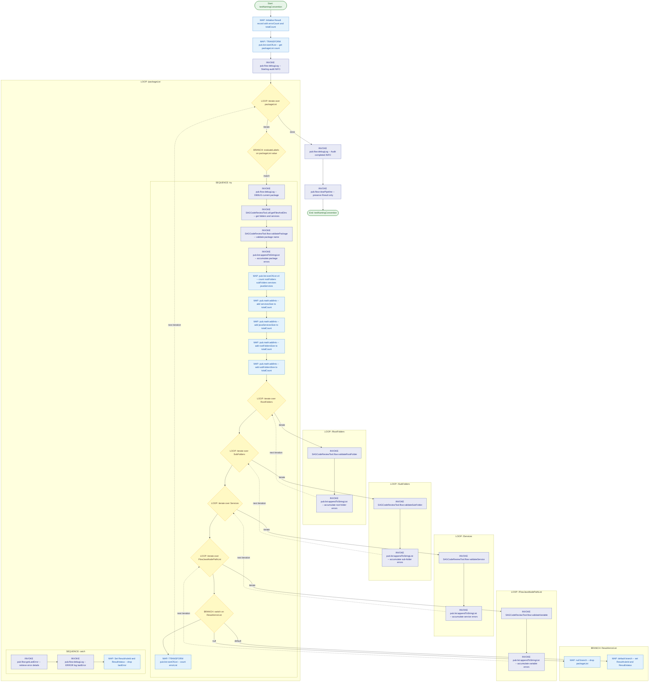

# Service Documentation: demo:testNamingConvention

## Purpose
Audits one or more webMethods Integration Server packages for compliance with naming conventions. For each package supplied, the service retrieves all structural assets (root folders, sub-folders, flow/Java services, and node path lists), validates each asset category against the SAGCodeReviewTool naming rules, and accumulates any violations into a `Result` document. The final pipeline state contains only the `Result` record, which captures the error count, total asset count, violation rule IDs, and overall audit status.

## Service Signature

### Inputs
| Parameter | Type | Constraints | Description |
|---|---|---|---|
| `packageList` | `String[]` | — | List of Integration Server package names to audit for naming convention compliance. |

### Outputs
| Parameter | Type | Description |
|---|---|---|
| `Result` | `record` | Audit result document containing `errorCount`, `totalCount`, `ruleId`, `status`, and `errorList` fields populated after all packages have been validated. |

## Flow Diagram

## Usage Examples

### Example 1 — Audit a single package
**Input:**
| Parameter | Value |
|---|---|
| `packageList` | `["MyIntegrationPackage"]` |

**Output:**
| Parameter | Value |
|---|---|
| `Result/totalCount` | Total number of assets audited (root folders + sub-folders + services + Java services) |
| `Result/errorCount` | Number of naming convention violations found |
| `Result/errorList` | List of violation messages (present when errors exist) |
| `Result/ruleId` | Rule identifier(s) associated with violations |
| `Result/status` | Audit status (`{}` indicates no violations or error set during catch) |

### Example 2 — Audit multiple packages
**Input:**
| Parameter | Value |
|---|---|
| `packageList` | `["PackageA", "PackageB", "PackageC"]` |

**Output:**
| Parameter | Value |
|---|---|
| `Result` | Aggregated audit result across all three packages |

## Implementation Details

The service executes the following steps:

1. **Initialise** — A `MAP` block initialises the `Result` record with empty `errorCount` and `totalCount` fields.
2. **Package count** — `pub.list:sizeOfList` counts the number of packages provided for auditing.
3. **Audit start log** — `pub.flow:debugLog` writes an INFO entry marking the start of the audit.
4. **Outer LOOP over `packageList`** — Iterates once per package. Inside the loop a `BRANCH` evaluates the current package name, routing to a try/catch SEQUENCE pair:
   - **Try SEQUENCE:**
     - Logs the current package name at DEBUG level.
     - Calls `SAGCodeReviewTool.util:getFilesAndDirs` to retrieve all root folders, sub-folders, services, and flow/Java node paths for the package.
     - Calls `SAGCodeReviewTool.flow:validatePackage` to check the package-level naming rules and accumulates any errors into a running list via `pub.list:appendToStringList`.
     - Counts each asset category using four `pub.list:sizeOfList` TRANSFORMs and adds each count to a running `totalCount` via four `pub.math:addInts` TRANSFORMs.
     - **Inner LOOP over `RootFolders`** — calls `SAGCodeReviewTool.flow:validateRootFolder` per root folder and accumulates errors.
     - **Inner LOOP over `SubFolders`** — calls `SAGCodeReviewTool.flow:validateSubFolder` per sub-folder and accumulates errors.
     - **Inner LOOP over `Services`** — calls `SAGCodeReviewTool.flow:validateService` per service and accumulates errors.
     - **Inner LOOP over `FlowJavaNodePathList`** — calls `SAGCodeReviewTool.flow:validateVariable` per node file and accumulates errors.
     - **BRANCH on `Result/errorList`** — if null (no errors), drops `packageList`; if errors exist (default), sets `Result/ruleId` and `Result/status`.
     - Counts the final `errorList` size via `pub.list:sizeOfList`.
   - **Catch SEQUENCE:** On any exception, calls `pub.flow:getLastError`, logs the error at ERROR level via `pub.flow:debugLog`, sets `Result/ruleId` and `Result/status`, and drops `lastError`.
5. **Audit end log** — `pub.flow:debugLog` writes an INFO entry marking completion.
6. **Pipeline cleanup** — `pub.flow:clearPipeline` is called with `preserve = ["Result"]`, leaving only the audit result in the pipeline.

## Error Handling

Error handling is implemented using a try/catch pattern via sibling `SEQUENCE` blocks inside the outer `LOOP`:

- **Try path** — The inner `SEQUENCE` (comment: `"try"`) contains all validation logic. If any invoked service throws an exception, execution transfers to the catch SEQUENCE.
- **Catch path** — The sibling `SEQUENCE` (comment: `"catch"`) calls `pub.flow:getLastError` to retrieve the exception, logs it at `ERROR` level, and sets `Result/ruleId` and `Result/status` to empty document values (`{}`). This ensures the `Result` record is always in a valid state even if a package audit fails mid-execution.

> **Note:** The try/catch is implemented using legacy `SEQUENCE` sibling blocks rather than the native `TRY/CATCH` construct introduced in IS 10.3+. On IS 10.3 or later this should be migrated to native `TRY { ... } CATCH { ... }` blocks.

## Related Services
| Service | Purpose |
|---|---|
| `SAGCodeReviewTool.util:getFilesAndDirs` | Retrieves all root folders, sub-folders, flow services, and Java node paths for a given package. |
| `SAGCodeReviewTool.flow:validatePackage` | Validates the package-level naming convention and returns a list of violations. |
| `SAGCodeReviewTool.flow:validateRootFolder` | Validates root folder names against naming convention rules. |
| `SAGCodeReviewTool.flow:validateSubFolder` | Validates sub-folder names against naming convention rules. |
| `SAGCodeReviewTool.flow:validateService` | Validates service names against naming convention rules. |
| `SAGCodeReviewTool.flow:validateVariable` | Validates flow/Java node variable names against naming convention rules. |
| `pub.list:sizeOfList` | Returns the size of a list; used here to count assets and errors. |
| `pub.list:appendToStringList` | Appends one list to another; used to accumulate violation error lists. |
| `pub.math:addInts` | Adds two integers; used to accumulate the running total asset count. |
| `pub.flow:getLastError` | Retrieves the last exception trapped in the flow; used in the catch block. |
| `pub.flow:debugLog` | Writes messages to the server log at configurable severity levels. |
| `pub.flow:clearPipeline` | Clears the pipeline, preserving only the `Result` record for the caller. |

## Notes
- **`pub.flow:debugLog` usage** — This service uses `pub.flow:debugLog` for audit progress and error logging. Per the ISCCR FQ6 rule, `pub.flow:debugLog` should be replaced with a configurable logging framework before deployment to production environments.
- **`pub.flow:clearPipeline` usage** — Per ISCCR FQ2, use of `pub.flow:clearPipeline` is flagged. The preferred approach is to explicitly `drop` all intermediate variables rather than clearing the entire pipeline. However, the `preserve` parameter is used here to retain `Result`, which mitigates most of the performance concern.
- **Legacy try/catch pattern** — The try/catch uses the old `SEQUENCE` sibling block pattern. Migrate to native `TRY/CATCH` if running on IS 10.3+.
- **`specificationReference`** — The service is linked to `SAGCodeReviewTool.doc:codeReviewRule` via the `specificationReference` property, tying it to the formal rule specification document.
- **No service signature** — The service declaration has no `(input { } output { })` block. `packageList` must be present in the pipeline before invocation; `Result` is returned via the pipeline rather than a declared output signature.
- **Stateless: false** — Unlike most utility services, this service is marked `stateless: false`, indicating it may retain or depend on session state.
